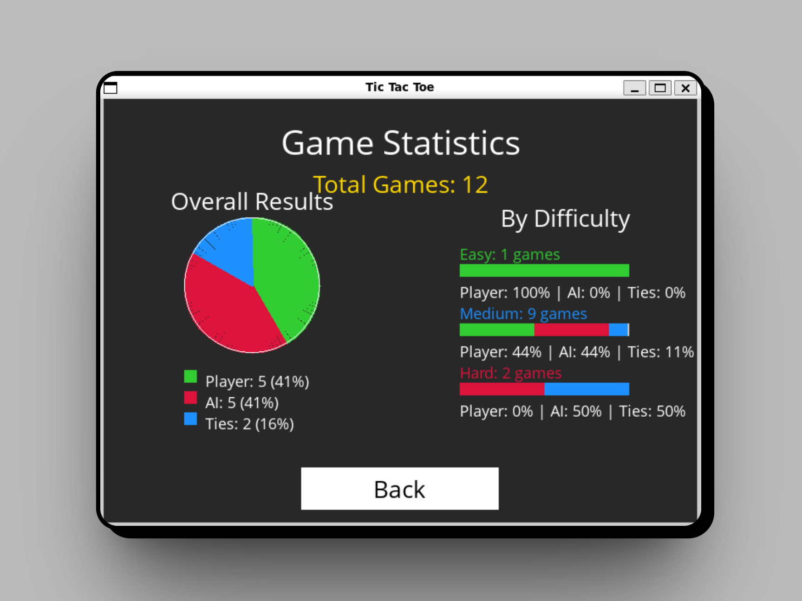

# 🎮 Tic Tac Toe Project

[](https://www.python.org/)
[](https://www.pygame.org/)
[](https://en.wikipedia.org/wiki/Minimax)
[](https://opensource.org/licenses/MIT)

_[Versión en español](README.md)_

## 📝 Description

This project implements the classic Tic Tac Toe game with a graphical interface using Pygame. The game includes an AI implemented with the Minimax algorithm that makes it impossible to beat - at most you can tie if you play perfectly.

## ✨ Features

-   🎯 Intuitive and user-friendly graphical interface
-   🤖 AI with Minimax algorithm for challenging gameplay
-   🎲 Option to play as X or O
-   🔄 Infinitely repeatable game
-   📊 Automatic detection of victory or tie

## 🖼️ User Interface

<div align="center">
  <table>
    <tr>
      <td></td>
      <td></td>
      <td></td>  
    </tr>
  </table>
</div>

## 🚀 How to run the game

```bash
# Install dependencies
pip install -r requirements.txt

# Run the game
python runner.py
```

## 🧠 What I've learned

During the development of this project, I've been able to learn and apply:

-   **AI Algorithms**: Implementation of the Minimax algorithm for decision making
-   **Game Theory**: Concepts of zero-sum games and optimal decision making
-   **Pygame Development**: Creation of interactive graphical interfaces
-   **Object-Oriented Programming**: Structuring code in a modular way
-   **State Management**: Handling different game states

## 🛠️ Technologies used

-   **Python**: Main programming language
-   **Pygame**: Library for graphical interface development
-   **Minimax Algorithm**: For the game's artificial intelligence

## 📋 Project structure

```
project-00-tictactoe/
├── OpenSans-Regular.ttf   # Font used in the interface
├── README.md              # Spanish version
├── README.en.md           # This file
├── requirements.txt       # Project dependencies
├── runner.py              # Main code and interface logic
└── tictactoe.py           # Game logic and Minimax algorithm implementation
```

## 📄 License

This project is under the MIT License - see the LICENSE file for more details.

---
## 👨‍💻 Autor

### [David Sandoval](https://github.com/sandovaldavid)

-   🌐 Portafolio: [devsandoval.me](https://devsandoval.me)
-   💼 LinkedIn: [@devsandoval](https://linkedin.com/in/devsandoval)
-   💻 GitHub: [@sandovaldavid](https://github.com/sandovaldavid)
-   📧 Email: [contact@devsandoval.me](mailto:contact@devsandoval.me)
--

⭐ **Developed as a learning project** ⭐

---

<div align="center">
  <p>
    <small>Developed as part of <span style="font-weight: bold;">CS50's Introduction to Artificial Intelligence with Python</span> course on Edx - 2024</small>
  </p>
  
</div>
