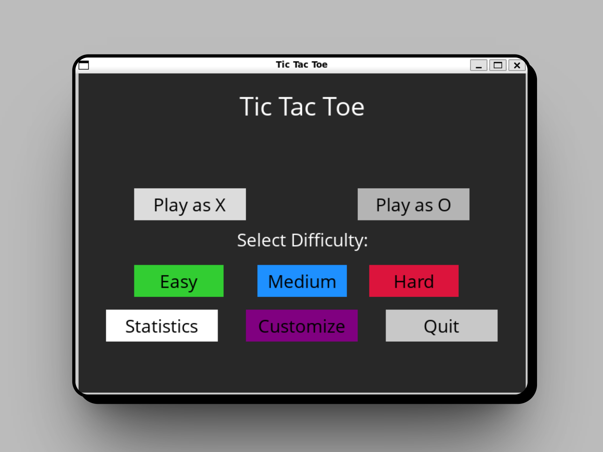
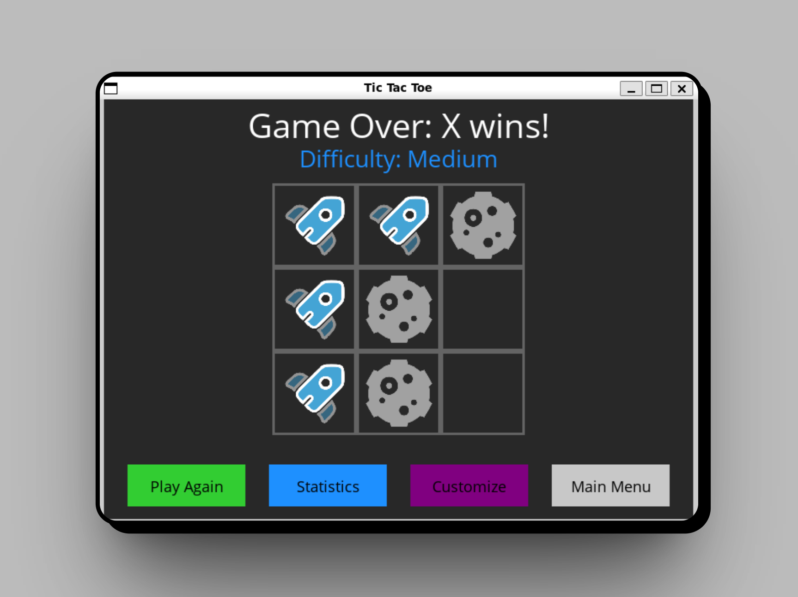
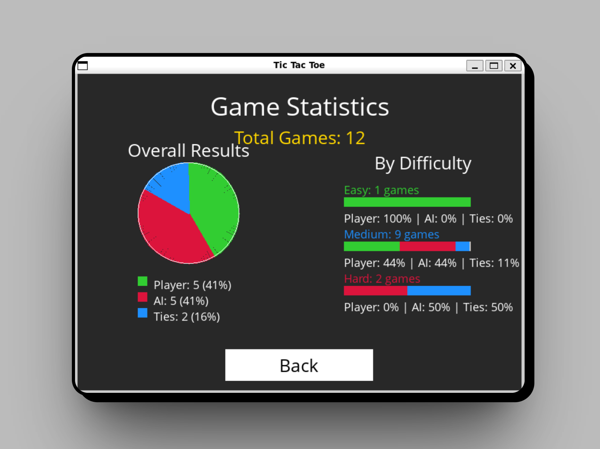

# 🎮 Proyecto Tic Tac Toe

[](https://www.python.org/)
[](https://www.pygame.org/)
[](https://en.wikipedia.org/wiki/Minimax)
[](https://opensource.org/licenses/MIT)

_[English version](README.en.md)_

## 📝 Descripción

Este proyecto implementa el clásico juego de Tic Tac Toe (Tres en Raya) con una interfaz gráfica utilizando Pygame. El juego incluye una IA implementada con el algoritmo Minimax que hace que sea imposible ganarle - a lo sumo podrás empatar si juegas perfectamente.

## ✨ Características

-   🎯 Interfaz gráfica intuitiva y amigable
-   🤖 IA con algoritmo Minimax para una jugabilidad desafiante
-   🎲 Opción de jugar como X u O
-   🔄 Juego infinitamente repetible
-   📊 Detección automática de victoria o empate

## 🖼️ Interfaz de Usuario

<div align="center">
  <table>
    <tr>
      <td></td>
      <td></td>
      <td></td>      
    </tr>
  </table>
</div>

## 🚀 Cómo ejecutar el juego

```bash
# Instalar las dependencias
pip install -r requirements.txt

# Ejecutar el juego
python runner.py
```

## 🧠 Qué he aprendido

Durante el desarrollo de este proyecto, he podido aprender y aplicar:

-   **Algoritmos de IA**: Implementación del algoritmo Minimax para la toma de decisiones
-   **Teoría de juegos**: Conceptos de juegos de suma cero y toma de decisiones óptimas
-   **Desarrollo con Pygame**: Creación de interfaces gráficas interactivas
-   **Programación orientada a objetos**: Estructuración del código de manera modular
-   **Gestión de estados**: Manejo de los diferentes estados del juego

## 🛠️ Tecnologías utilizadas

-   **Python**: Lenguaje principal de programación
-   **Pygame**: Biblioteca para el desarrollo de la interfaz gráfica
-   **Algoritmo Minimax**: Para la inteligencia artificial del juego

## 📋 Estructura del proyecto

```
project-00-tictactoe/
├── OpenSans-Regular.ttf   # Fuente utilizada en la interfaz
├── README.md              # Este archivo
├── requirements.txt       # Dependencias del proyecto
├── runner.py              # Código principal y lógica de la interfaz
└── tictactoe.py           # Implementación de la lógica del juego y algoritmo Minimax
```

## 📄 Licencia

Este proyecto está bajo la Licencia MIT - consulta el archivo LICENSE para más detalles.

---

⭐ **Desarrollado como parte de un proyecto de aprendizaje** ⭐

---

<div align="center">
  <p>
    <small>Desarrollado como parte del curso <span style="font-weight: bold;">CS50's Introduction to Artificial Intelligence with Python</span> de Edx - 2024</small>
  </p>
  
</div>
